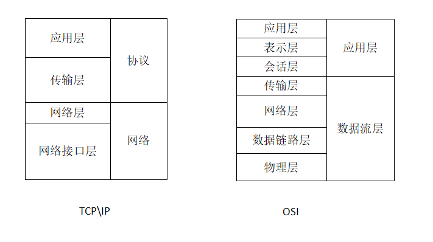
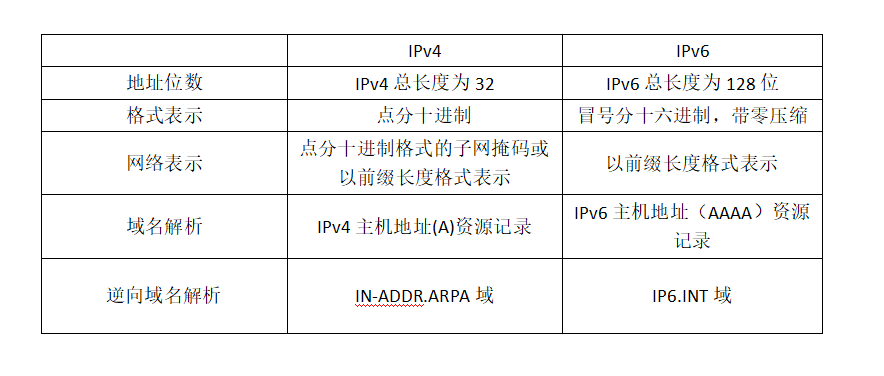

# 网络

网络体系结构有`OSI`参考模型和`TCP/IP`模型。前者算是理论，后者是互联网和技术上的开发标准。

`OSI`参考模型由下向上包含**物理层**、**数据链路层**、**网络层**、**传输层**、**会话层**、**表示层**、**应用层**。

`TCP/IP`模型简化了`OSI`，模式由下向上包含**网络接口层**、**网络层**、**传输层**、**应用层**。

`TCP/IP`相比`OSI`对下隐藏了底层细节，`TPC/IP`更多倾向于网络的连接。

## OSI

物理层向下与传输介质相连接，向上与`数据链路层`连接，它的作用是在两者之间提供物理连接来按顺序传输数据位，解决主机等数据终端与通信线路上通信 设备之间得接口问题。

- 传输介质：有线包含**双绞线**、`**同轴电缆**、**光纤**，无线包含 **微波通信**、**红外线通信**
- 数据位：数据通信中得概念，表示一组数据包含得数据位数。

数据链路层向上毗邻网络层，其通过帧同步、差错控制法和流量控制等向物理链路层提供数据传输，在相邻结点之间进行数据传输。高级数据链路控制协议：HDLC。常见设备：网卡、交换机。

- 帧同步： 帧是一种协议数据单元，被数据链路层采用作为数据传输逻辑单元。一般格式：帧开始、地址、长度/类型、数据、PCS、帧结束。
- 差错控制： 纠正由如噪声干扰、无线电干扰等导致接收端和发送端实际发出得数据不一致。常用检错码方案。
- 流量控制： 解决因硬件问题如 CPU 和软件功能等导致发送方和接收方速率不匹配所导致得帧丢失问题。常见协议：滑动窗口协议、停止等待协议。

网络层是端到端之间数据传输得最底层，**物理层**、**数据链路层**、**网络层**合在一起进行数据得传输，同时网络层也是通信子网的最高层。向上对于传输层，网络提供有面向连接和面向无连接来进行电路交换方式或储存转发交换方式的数据传输。

运输层为上一层提供端到端的信息传递。**会话层**主要是连接两个结点。**表示层**主要是定义用于交换得到数据结构、数据加密和文件加密。**应用层**为最顶层，负责向用户提供基于应用程序的网络服务。

可以看出在表示层以下的各层主要用于数据的传输，以上和当前层主要是对于数据的应用和提供网络服务。

## TCP/IP

相较于`OSI`参考模型，`TCP/IP`模型才是实际所使用最广泛的模型。

TCP/IP 网络层以数据报形式向传输层提供面向无连接的服务。网络层协议包括**IP 协议**、**ARP 协议**、**RARP 协议**等

TCP/IP 运输层提供稳定的网络运输，主要协议包含**TCP**、**UDP**。

TCP/IP 应用层支撑协议包含**DNS**、**SNMP**、**HTTP**、**FTP**等

### IP 协议

`IP 协议`是 TCP/IP 体系中两个最重要的协议之一，主要功能是使互联起来的许多计算机网络能够通信。

IP 数据报即使 IP 分组用以统一不同的网络技术在 TCP/IP 的网络中对异构网络互联的支持。IP 数据报由`首部`和`数据`两部分构成。首部是所有 IP 数据报必须所具有的部分，其字段包含：

- 版本；大小为 4 比特，指 IP 协议的版本。目前广泛使用 IPv4,未来技术 IPv6
- 首部长度；大小为 4 比特，数据报报头长度
- 服务类型；大小 8 比特，通信子网提供的服务类型
- 总长度；大小 16 比特，数据报的总长度，以字节为单位。

IP 地址以 32 位二进制的形式储存在计算机中，由`网络标识`和`主机号`组成。由于 32 位进制的 IP 地址不易书写和记忆，通常采用十进制标识法来表示 IP 地址。这种表示为：将 32 位的 IP 地址分为 4 个 8 位组，每个 8 位组以一个十进制数表示，取值范围为 0-255，相邻 8 位组用小圆点分割。IP 地址最低为 0.0.0.0，最高地址为 255.255.255.255。

以最高位地址来分类网络可分为以下五类：

- A 类地址 范围：0.0.0.0- 127.255.255.255 用于支持超大型网络
- B 类地址 范围：128.0.0.0- 191.255.255.255 用于支持中大型网络
- C 类地址 范围：192.0.0.0- 223.255.255.255 用于支持小型网络
- D 类地址 范围：224.0.0.0- 239.255.255.255 用于支持组播
- E 类地址 范围：240.0.0.0- 127.255.255.255 保留给未来扩充使用

IPv6 和 IPv4 比较如下：

### TCP 协议

TCP 协议中文名为`运输控制协议`，可以看出其协议主要作用于端到端的可靠运输。TCP 使用主机的 IP 地址加上主机的端口号作为 TCP 连接的端点。

#### TCP 连接

- SYN 建立连接
- ACK 响应请求
- RST 重置请求

TCP 使用三次握手来建立连接，连接可由任何一方发起，也可由双方同时发起。TCP 简单的连接过程如上图所示。

主机一发起 TCP 连接请求，把发送的分段中编码位字段中的 SYN 位置为**1**，ACK 为**0**。

主机二收到该分段，如果同意连接就发送一个应答分段，把编码位字段的 SYN 和 ACK 位均置为**1**，如果拒绝连接，主机二就发送一个将 RST 位置位**1**的分段。

主机一收到主机二的应答，如果要建立这个连接，则向主机二发送确认分段，如果不想建立这个连接，则发送一个将 RST 位置为**1**的应答分段。

#### TCP 关闭

- FIN 关闭连接

在数据传输完成后，就要进行 TCP 的关闭。TCP 连接是全双功的，可以看成是两个不同方向的单工数据流运输，一次完整连接的拆除涉及两个单向连接的拆除，所以有四次挥手。主机一到主机二的数据流断开，主机二到主机一的数据流断开。如上图所示。

主机一发送一个将编码位字段的 FIN 位置**1**的分段给主机二。如果主机二接收到了主机一的所有字段，就会发送一个数据分段正确接收的确认分段，同时通知本地对应的应用程序，对方要求关闭连接，然后再发送一个对主机一发送的 FIN 分段进行确认的分段。如果没有接收完全，主机一就会重传主机二没能正确接收的分段。

收到主机二 FIN 确认后的主机一需要再次发送一个确认拆除连接的分段，主机二接收该分段后意味着从主机一到主机二的单向连接已经结束。

主机二到主机一的关闭需要当主机二数据发送完毕后并要求关闭连接后才会关闭。当两个单向连接都被关闭时，原来建立的 TCP 连接就被完全释放，关闭。

### DNS 和 SNMP

`DNS`提供主机域名到 IP 地址的转换

`SNMP`是一个用于管理 IP 网络上结点的协议。便于网络管理员可以管理网络性能、查找和解决网络网络、以及规划网络的增长。

## HTTP

`HTTP`协议作用于 TCP/IP 应用层，中文名为`超文本传输协议`，用于浏览器和 WWW 服务器之间传输超文本文件。

HTTP 是基于 C/S 的架构模型。三点注意：

- http 是无连接的：处理完得到应答就会断开连接。
- http 是媒体独立的：只要客户端和服务端知道如何处理的数据内容，任何类型的数据都可以通过 http 发送。
- http 是无状态的：http 协议是无状态协议，不会保存。

### 结构

一个 http 请求格式：请求行、请求头、空行和请求数据。

http 响应包含：状态行、消息抱头、空行、响应正文。

### 请求方法

主要方法为`GET`和`POST`。二者区别如下：

- GET 请求数据会被拼接到 url 上，而 url 长度最大为 2048 ,POST 不会则数据更安全不可见
- GET 能缓存 ,POST 不能缓存
- GET 参数保留在浏览器历史中, POST 不会
- GET 编码为 application/x-www-form-urlencoded, POST 多了一个 multipart/form-data
- GET 只允许 ASCLL 字符 ,POST 无此限制，同时支持二进制数据

### 状态码

常见的 HTTP 状态码：

- 200 - 请求成功
- 301 - 资源（网页等）被永久转移到其它 URL
- 404 - 请求的资源（网页等）不存在
- 500 - 内部服务器错误

## HTTPS

https 在 http 上进行了一层加密。

https 和 http 区别

- http 的明文传输数据，https 数据传输过程会被加密，安全性更好。
- http 响应更快，https 相比于 http 的 TCP 三次握手产生的 3 个包，还要多出 ssl 握手需要的 9 个包
- http 使用 80 端口，https 使用 443 端口
- https 是 http+ssl 的一个协议，会消耗跟多资源

### 对称加密

双方使用同一个私钥，发送方通过私钥加密后传给接收方，接收方通过这个私钥解密。

### 非对称加密

有一对公钥和私钥，公钥随意发布，私钥只有自己知道。发送方通过公钥加密，接收方通过私钥解密。

### 加密过程

HTTPS 加密过程结和使用了对称加密和非对称加密。

过程：使用对称加密加密要传输的内容，使用非对称加密作用于证书验证。因为对称加密效率低所以用在证书验证，通信则使用对称加密的方式

1. 发起 https 请求，服务端返回 https 证书，客户端进行验证
2. 客户端验证合法后本地生成随机数，使用公钥进行加密并发送给服务端
3. 服务端通过私钥对随机数进行解密，再用这个随机数构造对称加密算法
4. 后面就使用这个对称加密算法来进行通信
