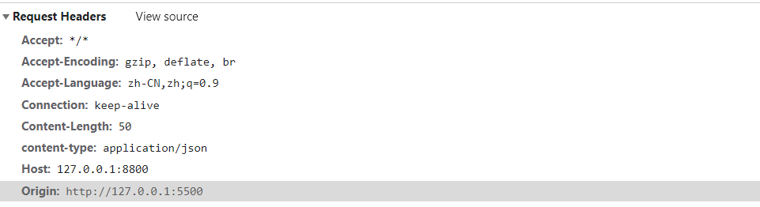
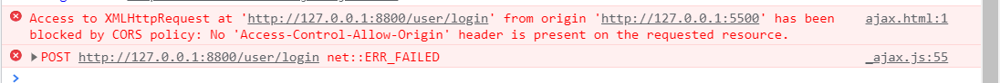
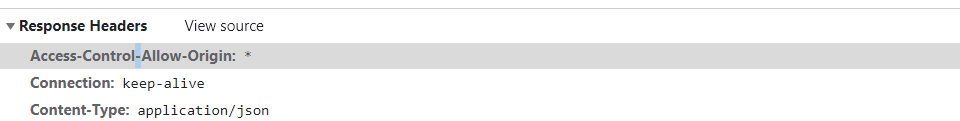

# 跨域

由于浏览器的同源策略，不允许一个域上的脚本访问另外一个域的文档。同源指协议、域名、端口都相同，如果有一个不同，那么进行访问就会报错，ajax 请求失败。

Chrome 和 Firefox 不允许从 HTTPS 跨域访问 HTTP。

## JSONP

可以通过`jsonp`来解决跨域问题，不过 jsonp 只针对 GET 请求有用。

```html
<script src="http://api.pmthank.cn/#/?id=a&name=b&callback=getData"></script>
<script>
  function getData(e) {
    console.log(e);
  }
</script>
```

## CORS

`CORS`为 W3c 一个标准，全称为`跨域资源共享`，它允许浏览器跨域的去向服务器发出`XMLHttpRequest`请求。

`CORS`需要浏览器和服务器同时支持，在通信过程中，浏览器会自动的完成这个支持（自动在 ajxa 中添加一些信息）。关键在于后端时候支持。

### 请求类型

`CORS`请求分为**简单请求**和**非简单请求**

简单请求需要满足以下要求：

- 请求方法为 HEAD、GET、POST
- HTTP 的头信息不超出这些字段 Accept、Accept-Language、Content-Language、Last-Event-Id、Content-Type

不满足以上情况的都属于非简单请求

#### 简单请求

浏览器发现这次请求是简单请求后，浏览器就会在头信息中增加`Origin`字段

```js
import _ajax from "./_ajax.js";
const api = "http://127.0.0.1:8800/user/login";
const post = _ajax.post(api, {});
```



这个`Orgin`字段用来告诉后端这个请求的`源`，来判断这个请求是否在服务器的许可`源`范围。不在则放回一个不包含`Access-Control-Allow-Origin`字段的头信息，从而被`onerror`捕获进而报
错。

后端设置只允许`http://localhost:8888`访问

```java
@CrossOrigin(origins = {"http://localhost:8888"})
```

前端报错如下



如果存在返回就如下所示，`Response Headers` 包含字段`Access-Control-Allow-Origin`，这个字段用来表示接受那些`域名`的请求，这里我用`spring`启动了一个服务器，后端设置`*`来表示接受任意域名请求。



还有其他字段如：`Access-Control-Allow-Credentials`字段表示是否允许发送`Cookie`，默认不被包含在请求中，设置为`true`允许[跨域发送 Cookie](/frontEnd/basic/browser/storage.html)。

`Access-Control-Expose-Headers`字段解除`XMLHttpRequest`对象的`getResponseHeader()`方法的限制。`getResponseHeader()`默认可拿到字段：

- Cache-Control
- Content-Language
- Content-Type
- Expire
- Last-Mondified
- Pragma

#### 非简单请求

非简单请求会在通信前增加一次请求（`预检`）来确定当前域名是否存在于服务器的源名单中，以及可用的 HTTP 动词和头信息字段。

`预检`头信息包含字段：`Access-Control-Request-Method`字段表示浏览器用到得请求方法。`Access-Control-Request-Headers`字段罗列额外发送的头信息字段。

服务器不通过`预检`就会报错，通过即后面的请求就会和简单请求一样。
