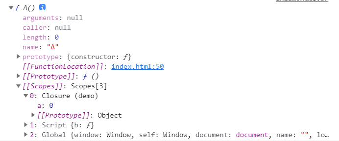

# 函数

js 里面函数是**一等公民**,声明关键字`function`。

```js
console.log(fun()); //1 ，
function fun() {
  return 1;
}
var a = function A() {};
const b = function () {};
```

箭头函数能使得创建函数更加简洁，而且解决了[`this`](/frontEnd/basic/ecmaScript/this) 的问题。

```js
const c = () => {};
```

## 普通函数

每一个函数有一个`arguments`属性，可以直接使用，它用来获取函数的参数值。

```js
const demo = function (a, b, c) {
  console.log(arguments); //[1,2,3]
};
demo(1, 2, 3);
```

该属性能使用数组的使用方式来操作，但它不是一个数组，是类数组。可以使用`Array.form()`来转换

```js
console.log(Array.isArray(arguments)); //false
console.log(arguments[1]); //2
console.log(Array.isArray(Array.from(arguments))); //true
```

es6 新增函数参数的默认值，rest 参数等。

```js
const f = ({ a, b } = {}, ...res) => {
  console.log(a + b); //2
  console.log(res); //  [1,2,3]
};
f({ a: 1, b: 1 }, 1, 2, 3);
```

## 构造函数

作为构造函数的函数其函数名一般大写来和普通函数区分。

```js
function Animal() {}
```

构造函数可看作面向对象语言中的`类`。

```js
function Animal(type) {
  this._type = type.toUpperCase();
  this.get = function () {
    console.log(`you creat a ${this._type}`);
  };
}
const cat = new Animal("cat");
cat.get(); //you creat a CAT
```

### Class

es6 新增`class`关键字来让 js 更加靠近`类`。

```js
class Animal {
  constructor(type) {
    this.type = type;
  }
  get() {
    console.log(`you creat a ${this.type}`);
  }
}
const cat = new Animal("cat");
cat.get(); //you creat a cat
```

同时还有关键字`static`,来声明静态属性，静态方法。`#`来声明私有属性。

```js
static ins = null;
# privte = null
```

## 箭头函数

ES6 新增箭头函数。`=>`。简化函数写法。

使用注意：

- 箭头函数没有自己得 this，this 指向外层代码块得 this，同时没有 arguments。
- 不能使用 new 名命，无法作为构造函数使用。
- 不能使用 yield。

```js
var o = 1;
const obj = {
  o: 0,
  fnc: () => {
    //无论嵌套多深，都指向obj所在的外层上下文。
    console.log(this.o);
  },
};
obj.fnc(); //1
```

## 闭包

什么是闭包：返回得函数使用了调用函数得变量，那么返回得函数就是闭包

```js
function demo() {
  const a = 0;
  return function A() {
    console.log(a);
  };
}
const b = demo();
b(); //0
```

A 函数会保存 demo 函数得变量，所以滥用闭包可能会造成内存泄漏。同时闭包会形成伪作用域。`console.dir(b)`打印如下：



## 函数科里化

什么是科里化:把接受多个参数的函数变换成接受一个单一参数（最初函数的第一个参数）的函数，并且返回接受余下的参数而且返回结果的新函数的技术。

可应用于多惨函数分段传入需求。

具体函数如下形式：

```js
const add = (a, b, c) => {
  console.log(a + b + c);
};
const _add = (a) => {
  //科里化后
  return (b) => {
    return (c) => {
      console.log(a + b + c);
    };
  };
};

add(1, 2, 3); //6
_add(1)(2)(3); //6
```

一个简易函数实现如下：

```js
const currying = (fun, _args) => {
  const length = fun.length;
  let args = _args || [];
  return (...res) => {
    args.push(...res);
    if (args.length < length) return currying.call(this, fun, args); //判断参数接收情况
    return fun.apply(this, args);
  };
};
add = (a, b, c) => {
  console.log(a + b + c);
};
const _add = currying(add);
_add(1, 5, 4); //10
_add(1)(5, 4); //10
_add(1)(5)(4); //10
```
