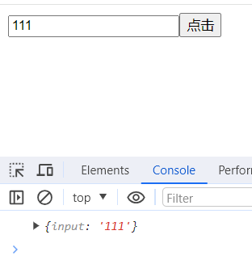

# 表单

罗列一下工作以来有收获的东西的话，就应该是这个表单了。起因是在开发小程序的过程中，发现没有类似于`Ant Design`中表单的组件，业务上的控件也不少，可以复现的地方也有，于是乎就想着自己去实现一下表单的组件。

万丈高楼平地起，首先我们先从小的功能开始实现。

## 收集数据

首先我们实现一个这样一个功能：在输入框输入数据，然后点击按钮，控制台打印相关数据。要实现的代码如下：

```jsx
const demo = () => {
  return (
    <Form>
      <Form.item name="input">
        <input />
      </Form.item>
      <Button>console</Button>
    </Form>
  );
};
```

逐层分析，首先要实现`Form`组件，该组件需要具备几个功能点：

- 存储 Store
- 响应 Button 的点击

### 实现 Form 等组件

储存 Store 声明一个 state 即可，响应按钮点击使用 form 表单的 submit 属性。如下，

```jsx
// 表单的实现
const Form: React.FC<Props> = (props) => {
  const { children } = props;
  const [store, setStore] = useState({});

  return (
    <form
      action=""
      onSubmit={(e) => {
        e.preventDefault();
        console.log(store);
        return false;
      }}
    >
      {children}
    </form>
  );
};
```

使用就是这样：

```jsx
<Form>
  <button type="submit">点击</button>
</Form>
```

接下来就是`Form.item`，首先就是这个写法，由于组件被导出后也是一个对象，我们就可以把`item`组件挂载在 Form 上就可以达到这个目的，我们先把这个样子写出来

先创建一个新的 Index 文件，用来作为唯一出口

```jsx

import FormInstace from "./FormInstace";
import Field from "./Field";

type form = typeof FormInstace

interface FormProps extends form {
    item: typeof Field
}

const Form = FormInstace as FormProps
Form.item = Field

export default Form
```

Field 文件如下：

```jsx
const Field: React.FC<FieldProps> = (props) => {
  const { children, name } = props;
  return <>{children}</>;
};
```

使用的地方稍微修改下：

```jsx
<Form>
  <Form.item name="input">
    <input />
  </Form.item>
  <button type="submit">点击</button>
</Form>
```

### 传递方法

到这里就离我们开始定义的那一步很近了，接下来的问题是怎么在 input 输入框有修改的时候把值写到 Form 组件中的`Sotre`里面去，修改方法有了，就是`setStore`,怎么传递下去呢？这里我采用的是 React 中的`Context`上下文，通过它把方法传下去。

```jsx
// 创建
const FormContext = React.createContext({})
// 在表单哪里包裹子组件
<Provider value={{ setStore }}>
  {children}
</Provider>
// field组件中通过useContext接收
const { setStore } = useContext(FormContext)
```

### 修改 Field 中的子组件

现在拿到了 setStore，剩下的就是监听到 input 的改变，由于`item`组件里面就包裹了`input`原生组件，所以我们只需要在`Field`组件中操作一下`children`就行了。

通过 clone 来劫持它原本的方法即可拿到`input`的值，当输入框的值发生了变化的话就可以拿到具体的值了，知道表单那个值改变了

```jsx
const copyChildren = useMemo(() => {
  if (React.isValidElement(children)) {
    const newProps = {
      ...children.props,
      onInput: (e) => {
        setStore((pre) => ({
          ...pre,
          [name]: e?.target?.value,
        }));
        children.props?.onInput?.(e);
      },
    };
    return React.cloneElement(children, newProps);
  }
  return children;
}, [name, children, setStore]);
```

### 效果



这样数据的收集就算完成了
