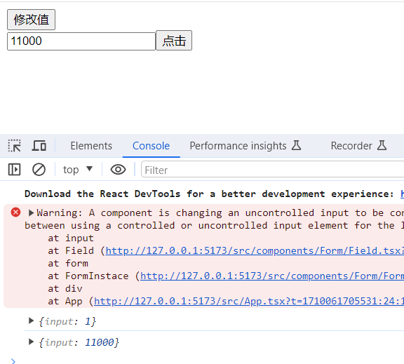
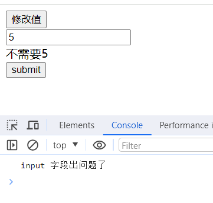

# 表单

罗列一下工作以来有收获的东西的话，就应该是这个表单了。起因是在开发小程序的过程中，发现没有类似于`Ant Design`中表单的组件，业务上的控件也不少，可以复现的地方也有，于是乎就想着自己去实现一下表单的组件。

万丈高楼平地起，首先我们先从小的功能开始实现。

## 收集数据

首先我们实现一个这样一个功能：在输入框输入数据，然后点击按钮，控制台打印相关数据。要实现的代码如下：

```jsx
const demo = () => {
  return (
    <Form>
      <Form.item name="input">
        <input />
      </Form.item>
      <Button>console</Button>
    </Form>
  )
}
```

逐层分析，首先要实现`Form`组件，该组件需要具备几个功能点：

- 存储 Store
- 响应 Button 的点击

### 实现 Form 等组件

储存 Store 声明一个 state 即可，响应按钮点击使用 form 表单的 submit 属性。如下，

```jsx
// 表单的实现
const Form: React.FC<Props> = (props) => {
  const { children } = props;
  const [store, setStore] = useState({});

  return (
    <form
      action=""
      onSubmit={(e) => {
        e.preventDefault();
        console.log(store);
        return false;
      }}
    >
      {children}
    </form>
  );
};
```

使用就是这样：

```jsx
<Form>
  <button type="submit">点击</button>
</Form>
```

接下来就是`Form.item`，首先就是这个写法，由于组件被导出后也是一个对象，我们就可以把`item`组件挂载在 Form 上就可以达到这个目的，我们先把这个样子写出来

先创建一个新的 Index 文件，用来作为唯一出口

```jsx

import FormInstace from "./FormInstace";
import Field from "./Field";

type form = typeof FormInstace

interface FormProps extends form {
    item: typeof Field
}

const Form = FormInstace as FormProps
Form.item = Field

export default Form
```

Field 文件如下：

```jsx
const Field: React.FC<FieldProps> = (props) => {
  const { children, name } = props;
  return <>{children}</>;
};
```

使用的地方稍微修改下：

```jsx
<Form>
  <Form.item name="input">
    <input />
  </Form.item>
  <button type="submit">点击</button>
</Form>
```

### 传递方法

到这里就离我们开始定义的那一步很近了，接下来的问题是怎么在 input 输入框有修改的时候把值写到 Form 组件中的`Sotre`里面去，修改方法有了，就是`setStore`,怎么传递下去呢？这里我采用的是 React 中的`Context`上下文，通过它把方法传下去。

```jsx
// 创建
const FormContext = React.createContext({})
// 在表单哪里包裹子组件
<Provider value={{ setStore }}>
  {children}
</Provider>
// field组件中通过useContext接收
const { setStore } = useContext(FormContext)
```

### 修改 Field 中的子组件

现在拿到了 setStore，剩下的就是监听到 input 的改变，由于`item`组件里面就包裹了`input`原生组件，所以我们只需要在`Field`组件中操作一下`children`就行了。

通过 clone 来劫持它原本的方法即可拿到`input`的值，当输入框的值发生了变化的话就可以拿到具体的值了，知道表单那个值改变了

```jsx
const copyChildren = useMemo(() => {
  if (React.isValidElement(children)) {
    const newProps = {
      ...children.props,
      onInput: e => {
        setStore(pre => ({
          ...pre,
          [name]: e?.target?.value
        }))
        children.props?.onInput?.(e)
      }
    }
    return React.cloneElement(children, newProps)
  }
  return children
}, [name, children, setStore])
```

### 效果


这样数据的收集就算完成了

## 注入数据

上面的操作我们实现了数据从输入框到 Store，但一般表单还需要实现数据从 Store 到输入框。也就是填充数据的过程。

注入可以同收集数据一样，劫持 input 组件的即可，将 value 值通过 props 注入。

```jsx
const newProps = {
  ...children.props,
  value: xxx
}
```

### FormStore 类

要完成这一步我们需要维护一个 Store，这个对象有修改、获取、校验等方法。它就是表单的核心类。

新建一个文件来维护 Store，如下它包含四个基本的获取、修改方法。

```ts
class FormStore {
  private store: any

  constructor() {
    this.store = {}
  }

  private getFieldValue = (name: string) => {
    return this.store?.[name]
  }

  private getFieldValues = () => {
    return {
      ...this.store
    }
  }

  private setFieldValue = (name: string, value: string) => {
    this.store[name] = value
  }

  private setFieldValues = store => {
    this.store = {
      ...this.store,
      ...store
    }
  }

  getForm() {
    return {
      getFieldValue: this.getFieldValue,
      getFieldValues: this.getFieldValues,
      setFieldValue: this.setFieldValue,
      setFieldValues: this.setFieldValues
    }
  }
}
```

### useForm

接下来需要修改`Form`组件，不再以`state`的方式来维护 Store，同时我们需要提供一个`hook`，来给使用者以操作表单的方式。再次创建一个文件来标明。

如下，使用`useRef`来实现单例模式，防止过多的创建对象。由于该 hook 也会在`Form`内使用，所以添加了一个入参。

```ts
const useForm = (form?: any) => {
  const ref = useRef()
  const formInstance = useMemo(() => {
    if (!ref.current) {
      if (form) {
        ref.current = form
      } else {
        const f = new FormStore()
        ref.current = f.getForm()
      }
    }
    return ref.current
  }, [form])
  return [formInstance]
}
```

### 修改例子

在`Form`中使用。

```tsx
interface Props {
    // xxx
    form?: any
}

const [formInstance] = useForm(form)

<Provider value={formInstance}>
  {children}
</Provider>
```

在 Field 中获取值

```tsx
const formInstance = useContext(FormContext)

value: formInstance.getFieldValue(name),
```

在实例组件处，我们写下如下代码。一个是渲染完成后自动填充值，一个是点击按钮手动修改字段的值。

```tsx
const [form] = useForm()

const updatedInputNumber = useCallback(() => {
  form?.setFieldValues({
    input: 11000
  })
}, [form])

useEffect(() => {
  form?.setFieldValues({
    input: 1
  })
}, [])
```

但实际上我们页面输入框里面的值没有改动，点击了按钮后也没有改动。为什么呢？实际打印 store 的值是改变了。但是由于这个值不是一个`state`，`React`并没有监听到了什么改变，从而去刷新组件。所以我们接下来需要去收集每一个`Field`，并在字段更新的时候通知需要更新的组件，这里可以使用发布订阅者模式。

### 收集 Fields

首先修改 Store 类，增加注册、更新等方法。

```ts
class FormStore {
  // 每一个Field
  private watchList: Field[]

  // 注册field
  private reigsterField = field => {
    this.watchList.push(field)
    return () => {
      this.watchList = this.watchList.filter(e => e?.name !== field?.name)
    }
  }

  // 通知更新方法
  private notifyWatchList = () => {
    this.watchList.forEach(e => {
      e?.onStoreChange()
    })
  }

  // 更改值时通知
  private setFieldValue = (name: string, value: string) => {
    this.store[name] = value
    this.notifyWatchList()
  }
}
```

修改`Field`组件

```tsx
// 维护一个state
const [updated, setUpdated] = useState(0)

// 增加一个依赖即可
const copyChildren = useMemo(() => {
  // xxx
}, [updated])

// 注册自己
useEffect(() => {
  const unMount = formInstance?.reigsterField({
    name,
    // 更新方法
    onStoreChange: () => {
      setUpdated(pre => pre + 1)
    }
  })
  return () => {
    unMount()
  }
}, [name])
```

这样的话，每当调用`setFieldValues`修改方法就会通知更新`Filed`组件，组件内部就可以拿到 Store 中的最新值，并注入子组件中。

### 效果



点击修改按钮，再打印就发现值和页面显示的一样了

## 校验字段

目前值的互传已经实现了，接着的是对值得校验，毕竟一些不符合要求的值可以在输入的时候就告诉用户。

### Rules

我们先确定一下校验的格式，这边参考了`Ant Design`的写法，简单的实现下面两种。

```tsx
interface Rule {
  required?: boolean
  validator?: (value: any) => Promise<void>
}

interface FieldProps {
  // xxx
  rules?: Rules[]
}
```

### 输入时校验

当用户输入的时候就需要做校验，所以先修改一下`Field`组件。

一个方法是校验`rules`这个 props 的方法，另一个是在当前字段下的值变化后去判断要不要展示信息的方法。同时给字段置默认值，防止误判初始状态。

```tsx
// 校验rules的方法
const validator = useCallback(async value => {
  const isRequired = rules.some(e => e?.required)
  if (isRequired && value !== undefined && !value) {
    return Promise.reject('该字段必填')
  }
  await Promise.all(rules.map(e => e?.validator?.(value)))
  setRuleText('')
}, [])

// 校验方法
const valid = async () => {
  try {
    await validator(formInstance.getFieldValue(name))
  } catch (error) {
    setRuleText(error || '')
  }
}

// 监听字段
useEffect(() => {
  valid()
}, [formInstance.getFieldValue(name)])

// 设置默认值
useEffect(() => {
  formInstance?.setFieldValue(name, undefined)
}, [formInstance, name])

return (
  <>
    {copyChildren}
    <br />
    {ruleText || ''}
  </>
)
```

### 收集校验方法

除了输入时校验，我们有时也需要校验整体字段，比如点击，所以接下来需要收集 Field 字段的校验方法。

注册`Field`时添加校验方法，同时修改校验方法判断是否将错误内容上抛

```tsx
const valid = async (isStore?: boolean) => {
  try {
    await validator(formInstance.getFieldValue(name))
  } catch (error) {
    setRuleText(error || '')
    if (isStore) {
      return Promise.reject(name)
    }
  }
}

const unMount = formInstance?.reigsterField({
  validator: valid
})
```

接下来在 Store 中添加对应的校验字段方法

```ts
class FormStore {
  private validatorVlaues = async () => {
    const res = await Promise.allSettled(
      this.watchList.map(e => e.validator(true))
    )
    const errArr = res.filter(e => e.status === 'rejected')
    // 这里可以拿到有问题的字段时那部分
    if (errArr?.length) {
      return Promise.reject(`${errArr[0]?.reason} 字段出问题了`)
    }
    return this.getFieldValues()
  }

  private sumbit = () => {
    this.validatorVlaues()
      // 调用Form组件的回调函数
      .then(res => onFinish(res))
      .catch(err => onFinishFailed(err))
  }
}
```

这样的话，既可以输入时校验，也可以点击校验。

简单修改下例子：

```tsx
<Form.item
  name="input"
  rules={[
    {
      required: true,
      validator: value => {
        if (value === '5') {
          return Promise.reject('不需要5')
        }
        return Promise.resolve()
      }
    }
  ]}
>
  <input />
</Form.item>
```

### 效果



这样一个简单的表单组件搞定了，样式可以随意调整。

参照`Ant Design`的话还有很多`Props`可以同步实现，比如`Form.List`，同时以上代码中也有很多的优化空间，比如 Store 中获取和设置字段值可以使用`lodash`中的方法，name 可以设置为数组（匹配 List 组件）、校验方法的优化等，但核心部分大概就这些。

同我之前工作中开发的组件也有一定差异，后续会加上其他模块的实现部分

::: tip 提示
未完待续
:::
