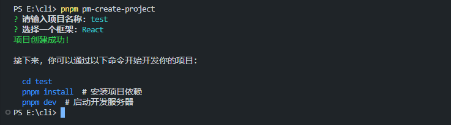

# 脚手架

从0开始写一个脚手架

## 什么是脚手架

`脚手架`一词多是出现在工程项目上，是一个保证施工的一个平台。在编码中一般指可以用于快速搭建一个项目的能力的工具。比如`Vite`,`create react app`等工具。

实际使用时，只需要输入某个命令，然后根据提示选择即可完成一个项目的搭建。一般效果如下图：



下面我们就来实现上面图片中的效果

## 可执行文件

首先我们从可执行文件入手，当输入命令按下回车后，运行的时可执行文件然后做出回应。

首先初始化项目

```bash
npm init -y
```

然后安装`inquirer`、`chalk`

```bash
pnpm i inquirer chalk
```

其中`inquirer`是一个用于构建交互式命令行界面的库。上面的交互则采用这个库实现，`chalk`则是一个在终端中为文本添加样式的库，可以输出多彩的文字。

### inquirer

主要功能

- 询问问题：你可以让用户在终端中回答一系列问题。
- 提供选择列表：通过单选或多选的方式让用户选择选项。
- 输入验证：可以对用户的输入进行格式验证，确保用户输入有效的数据。
- 动态问题：问题可以根据先前答案动态变化。
- 支持异步操作：你可以在询问过程中执行异步任务，比如从 API 拉取数据后再展示给用户选择。
  常见的提问类型
- input：让用户输入文本。
- confirm：要求用户确认 "是" 或 "否"。
- list：让用户从一个列表中选择一项。
- checkbox：让用户从多个选项中选择多项。
- password：隐藏输入的密码字段。

在这里我们只需要使用输入和选择即可。新建index.js 文件编写。

```js
import inquirer from 'inquirer'

const questions = [
  {
    type: 'input',
    name: 'projectName',
    message: '请输入项目名称:'
  },
  {
    type: 'list',
    name: 'framework',
    message: '选择一个框架:',
    choices: ['React', 'Vue']
  }
]

function createProject(answers) {
  const { projectName, framework } = answers
}

inquirer.prompt(questions).then(createProject)
```

其中questions就是我们定义的问题数组，但用户操作完后会在Promise的then中会获取到用户的操作。

首先根据文件名创建文件夹，通过`process.cwd()`获取当前工作目录，然后结合用户输入的名来生成新的目录

```js
const projectPath = path.join(process.cwd(), projectName)

if (!fs.existsSync(projectPath)) {
  fs.mkdirSync(projectPath)
}
```

接下来处理选择的类型，假设我们项目的根目录下已经存在两个模板目录`template-vue`和`template-react`，这里就是通过选择来复制不同的模板文件到上一步新生成的目录中

```js
import path from 'path'
import { fileURLToPath } from 'url'

// 获取当前文件的目录名
const __filename = fileURLToPath(import.meta.url)
const __dirname = path.dirname(__filename)

if (framework === 'Vue') {
  const templatePath = path.join(__dirname, '../template-vue')
  copyFolderSync(templatePath, projectPath)
}

if (framework === 'React') {
  const templatePath = path.join(__dirname, '../template-react')
  copyFolderSync(templatePath, projectPath)
}
```

copyFolderSync 如下：

```js
// 复制文件夹的递归函数
function copyFolderSync(from, to) {
  fs.mkdirSync(to, { recursive: true })
  fs.readdirSync(from).forEach(element => {
    const src = path.join(from, element)
    const dest = path.join(to, element)
    if (fs.lstatSync(src).isDirectory()) {
      copyFolderSync(src, dest) // 递归复制文件夹
    } else {
      fs.copyFileSync(src, dest) // 复制文件
    }
  })
}
```

### chalk

这时基本上就可以达到一个脚手架的功能了。不过执行完后没有美观输出。下面用`chalk`来进行输出文案的展示

```js
const chalk = (await import('chalk')).default

console.log(chalk.green('项目创建成功!'))
console.log(`\n接下来，你可以通过以下命令开始开发你的项目：`)
console.log(`\n  ${chalk.blue(`cd ${projectName}`)}`)
console.log(`  ${chalk.blue(`pnpm install`)}  # 安装项目依赖`)
console.log(`  ${chalk.blue(`pnpm dev`)}  # 启动开发服务器`)
```

由于我这边都是使用es module的模式，因此chalk采用上面的动态导入模式。

现在执行下面的命令应该可以达到上面图片中的效果。

```bash
node index.js
```

## npm link

现在将用node执行的方式修改为用npm来执行，这里需要用到 `npm link`知识，`npm link` 是一个用于在本地开发多个 Node.js 包时进行包链接的命令。它允许你在全局范围内注册一个包，然后在其他项目中通过符号链接来引用这个包，便于在多个项目间共享本地开发的包。

除外还有一个`bin`相关的内容,`bin` 通常用于定义命令行可执行文件。它让你的包能够在终端中作为命令行工具使用。通过配置 bin 字段，你可以让用户在全局或本地安装你的包后，直接运行一个命令来启动你的脚本。

像bin的描述那样，我们在项目的`package`中添加脚本：

```json
  "bin": {
    "pm-create-project": "./bin/index.js"
  },
```

这样你就可以使用`pm-create-project`或者`pnpm pm-create-project`来执行脚手架文件，然后通过`npm link`则可以在其他项目中也使用这命令，这样就简单的模拟了一个脚手架的使用。

如要让其他人也可以使用，则需要发布包到npm上面即可。

## 全部代码

```js
#!/usr/bin/env node

import inquirer from 'inquirer'
import fs from 'fs'
import path from 'path'
import { fileURLToPath } from 'url'

// 动态导入 chalk
;(async () => {
  const chalk = (await import('chalk')).default

  // 获取当前文件的目录名
  const __filename = fileURLToPath(import.meta.url)
  const __dirname = path.dirname(__filename)

  // CLI 问题
  const questions = [
    {
      type: 'input',
      name: 'projectName',
      message: '请输入项目名称:'
    },
    {
      type: 'list',
      name: 'framework',
      message: '选择一个框架:',
      choices: ['React', 'Vue']
    }
    // {
    //   type: "confirm",
    //   name: "typescript",
    //   message: "是否使用 TypeScript?",
    //   default: false,
    // },
  ]

  // 复制文件夹的递归函数
  function copyFolderSync(from, to) {
    fs.mkdirSync(to, { recursive: true })
    fs.readdirSync(from).forEach(element => {
      const src = path.join(from, element)
      const dest = path.join(to, element)
      if (fs.lstatSync(src).isDirectory()) {
        copyFolderSync(src, dest) // 递归复制文件夹
      } else {
        fs.copyFileSync(src, dest) // 复制文件
      }
    })
  }

  // 根据用户输入生成项目结构
  function createProject(answers) {
    const { projectName, framework } = answers

    const projectPath = path.join(process.cwd(), projectName)

    if (!fs.existsSync(projectPath)) {
      fs.mkdirSync(projectPath)
    }

    // 如果用户选择 Vue 框架，复制 template-vue 文件夹到目标路径
    if (framework === 'Vue') {
      const templatePath = path.join(__dirname, '../template-vue') // 模板路径
      copyFolderSync(templatePath, projectPath) // 复制模板文件
      //console.log(chalk.green("Vue 项目模板已复制!"));
    }
    if (framework === 'React') {
      const templatePath = path.join(__dirname, '../template-react') // 模板路径
      copyFolderSync(templatePath, projectPath) // 复制模板文件
      //console.log(chalk.green("React 项目模板已复制!"));
    }

    // 你可以根据其他框架添加更多的模板复制逻辑
    console.log(chalk.green('项目创建成功!'))
    console.log(`\n接下来，你可以通过以下命令开始开发你的项目：`)
    console.log(`\n  ${chalk.blue(`cd ${projectName}`)}`)
    console.log(`  ${chalk.blue(`pnpm install`)}  # 安装项目依赖`)
    console.log(`  ${chalk.blue(`pnpm dev`)}  # 启动开发服务器`)
  }

  inquirer.prompt(questions).then(createProject)
})()
```
