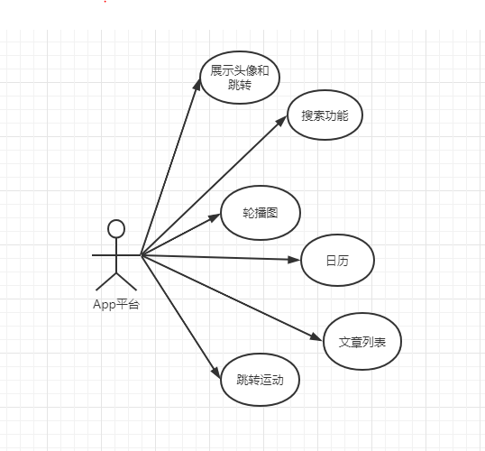

# 设计

## 摘要

近年来，随着人们生活质量的提高，以及过大的生活压力，导致人们的健康水平日渐低下。常年来，许多人们的身体状态处于一个亚健康的水平，由此引发各类疾病问题也是层出不穷，同时身体机能的下降也会导致人的精神状态相比于正常情况下大不如从前。因此，在生活，吃住越来越好的今天，健康问题也需要得到越来越多的重视。运动健康管理平台就是一个提供运动，数据检测，以及健康的评估的服务方式。

本课题研究的是基于 APP 的健康管理平台的设计与实现。首先步骤为查询国内外相关资源，了解其设计逻辑，以及相关 APP 的实现。

本课题采用 B/S,前后端分离架构进行软件开发。总体产出 APP，后台管理，api 集群。
前端中的 APP 采用 uniapp 进行开发，后台管理系统采用 React 进行开发

## 需求分析

### 功能需求分析

**App**

注册：提供手机号注册和账号注册两种方式
登录需求：提供多种登录需求，手机号登录，第三方登录，账号登录等

首页搜索需求：用户能够在首页上进行内容搜索，并提供实时反馈。
首页列表需求：展示 app 提供给用户的健康咨询文章列表，并且提供点赞，收藏，评论等需求，提供热评展示。
首页功能需求：提供一些功能列表，健康管理，跑步，数据分析等需求
首页视频播放需求：播放一健身视频。

run 跑步需求：提供跑步机制，实时记录数据，提供历史跑步数据查询，展示评价速度，消化卡路里等

圈子：提供发言，用户可在里面进行发言，提供发布言论按钮，提供对言论的点赞，收藏，评论功能，提供热评展示，对用户的关注。

用户：展示用户数据，头像，姓名等。展示收藏，评论列表。点击头像进去详情情况，包含被关注数量，今日跑步次数等，点击头像修改修改，点击姓名修改姓名。
https://www.tooopen.com/art/view/601b6b76656affb39cd7ea5a.html
https://www.uibaba.com/shows/308.html

设置：app 本身设置情况，用户推出，推送用户消息（收藏的信息变化推送等），清楚缓存，修改密码。

**后台管理系统**

登录需求：只能由超级管理员进行创建所产生的管理员才能进行登录

app 数据展示：展示 app 下载数据等情况，采用可视化的方式进行展示，
user 用户的管理：对用户数据进行管理，不涉及密码等隐私数据，不涉及删除，只涉及封禁，提供给 user 用户的查询，四大模块：累计运动量，运动统计，（中位数划分展示），run 数据。
app 信息的展示，版本号，反馈情况，搜索热词等。
run 数据的展示，搜索情况，排列情况，具体的信息以及轨迹的展示
圈子：用户发言列表的展示和添加管理员发言的功能，对数据的展示和处理，查看评论等功能。

设置：管理员列表，创建管理员和删除

## 需求分析

### 功能需求

从 App 本身角度进行分析，按照 App 模块进行拆分，可拆分出如下四大模块：首页模块、动态模块，运动模块、用户模块和系统模块，总计五个模块。下面依次对这五大模块进行分析。

首页模块：作为 App 启动页，该模块承载着平台对外输出的任务。具体功能可划分为展示登录用户头像、提供搜索功能、轮播图展示热点信息、日历打卡、点击跳转运动数据、文章列表等六个功能点。用例图如下：


动态模块：该模块主要用于展示用户动态，并且提供对动态的操作功能以及当前登录用户能够发布动态等三大功能点。用例图如下：

运动模块：该模块提供对跑步数据的记录，轨迹的绘制和历史记录查询三大功能点。用例图如下：

用户模块：该模块作为常见模块，具有基础的登录功能、注册功能、展示用户信息功能、修改用户信息功能、修改密码，除此之外还具有查询运动时间、上传身体数据、查询收藏、查询图片、查看关注用户等 10 个功能点用例图如下：

系统模块：该模块作用于系统级别，主要功能有推送信息、清除缓存、用户反馈、App 评星等四个功能点。用例图如下：

对后台管理系统进行分析，按照模块进行划分，可拆分出一下五个模块：首页信息模块、用户列表管理模块、App 控制模块
、运动数据模块、管理员模块、登录模块，总计六个模块。下面依次对着五个模块进行分析。

登录模块：该模块作为后台管理系统起始页，需要登录才能进入系统。用例图如下：

首页模块：展示 App 下载量、活跃度情况、用户注册量、访问量以及日志情况。用例图如下：

用户管理模块：展示 App 用户列表，查询基本信息和对用户进行操作，可分为：查询用户列表、查询当个用户信息、封禁用户三大功能点。用例图如下：

App 控制模块：该模块作用于 App 系统级别上面，对 App 本身信息的查询、文章列表的查询和操作、用户动态的查询和操作，可划分为：查看星级情况、查看搜索热词、查看反馈信息、删除热词、添加文章、查看文章、删除文章、添加系统动态、查询动态和删除动态等十个功能点。用例图如下：

数据分析：该模块主要作用于运动数据的分析，也具有对用户上传的身体数据进行分析的功能。详细划分可分为：上传参数、查询参数列表、健康度展示、年龄分布、运动数据查询等五个功能点。用例图如下：

系统模块：该模块用于管理员和推送方面。功能可划分为：展示管理员信息、添加管理员和发布推送等三个功能点。用例图如下：

业务流程

对 App 业务流程进行分析，流程图如下：

对后台管理系统流程进行分析，流程图如下：

### 非功能需求

社会 经济 环境 法律 技术

## 概要设计

### 系统总体架构设计

架构图

### 接口设计

**用户接口**

对于 App 的用户界面而言，每个模块的页面根据需求分析的结果，每个页面应该在设计上做到简单明了，易于操作，并且要合理布局，突出重要功能点和错误提示信息。参考相关优秀的 UI 设计，使用 uniapp 做出美观、简洁、友善的用户接口。其中对于首页页面应该做到布局合理，对于搜索页面应该做到内容列表分布清晰和错误搜索即时提醒，对于超出用户手机高度部分做出预测处理。对于用户动态列表页面应该做到数据分布合理，操作简单，具有即时的反馈。运动界面应做到轨迹清晰，跑步数据实时展示等重要功能点的实现。对于用户界面，应该分布合理，不易展示过多数据，用户相关信息如收藏等应该做出选项卡的形式进行切换展示，从而在使用上更简单。

总的来说，系统的用户界面应该做到可靠性、简单性、易于学习和使用。

**外部接口**

后端服务器程序可对 DAO（数据访问对象）应用程序进行编程接口（API），对 MySql 数据库能够进行所有数据的访问。整体数据传输使用 http 网络协议进行通信，必要时可使用 https 来保证数据传输的安全性。

**内部接口**

动态模块。对用户模块提供对动态的点赞、收藏、评论等接口。
运动模块。对用户模块提供生成、查询接口。
首页模块。对用户模块提供搜索接口。

### 运行设计

**运行模块**

客户端在启动时获取对应数据模块，通过网络传送模块，将数据通过网络传输到服务器，并等待服务器的响应，接受服务器放回的数据，产生相应的输出。当客户端运行时，在客户端在有输入的情况下，数据模块接受数据，通过各模块的调用，读入数据再对数据进行格式化。在数据模块数据已准备好的情况下，通过网络传输模块把数据传输到服务器，并等待服务器相应和根据服务器的相应数据做出对应的输出。

为保证客户端的使用，服务端程序应该始终保持在运行状态。接受到数据后，对数据进行分析处理，在对数据库进行访问，完成相应操作后调用网络发送模块，将信息放回客户端。

**运行时间**

在软件的需求分析中，对软件运行时间的要求为必须对软件中的各类操作做出迅速的反应。在网络硬件方面，网络硬件时影响运行时间的一大因素，当吞吐量较大时，服务端网络硬件应该能承受对应的压力。因此对应网络传输能采用 http 就采用 http 来加快访问，尽量采用多核、内存较大的服务器，同时在服务端系统采用 Linux 操作系统，减少图形化操作，使用命令行来控制整个系统。最终目的是让网络硬件更高效，满足系统运行时间要求。

## 数据库设计

### 数据库需求分析

数据库的需求分析作为数据库设计的第一阶段，该阶段主要是收集基本数据以及数据处理的流程。需求分析主要解决以下两个问题：
内容要求。分析平台本身信息所需要的数据和使用平台的用户以及操作所需要的数据，决定在数据库中储存什么数据
处理要求。分析用户会对数据库中的数据做出什么处理，理清数据之间的关系

在完成数据分析后，应该生成一个数据字典文档，该字典应该包含以下三个方面：
数据项。包含字段名称、含义、类型、取值范围、长度以及和其他数据线之间的关系
数据结构。由若干个数据项的集合，包括名称、含义以及组成数据结构的数据项
数据流。指数据库中数据的处理过程，包括输入、处理和输出。

针对本平台，设计的数据项和数据结构如下：
平台信息：包括 App 版本、搜索热词、推送消息等
文章信息：包括文章 uuid、发布作者、发布时间、内容详情、。
动态信息：包括动态动态 uuid、发布人 uuid、发布时间、发布内容、点赞数量、被收藏数量、评论列表等
跑步信息：包括跑步数据的 uuid、跑步者、开始时间、结束时间、轨迹数据、平均数据等
用户信息：包括用户 uuid、用户名、用户性别、用户爱好、用户密码、用户收藏、用户点赞等

### 数据概念结构设计

该阶段将设计各实体和展示对于的 E-R 图。

### 数据库逻辑结构设计

表的设计展示

## 模块设计

动态模块

搜索模块设计。该模块为用户服务，提供搜索功能，用户输入关键字，服务端放回结果进行展示。该模块应该作用于首页显眼位置。该模块提供搜索功能和结果展示以及未输入展示。
搜索功能：用户输入要搜索的内容，输入过程中或者在完成输入的情况下，都会调用搜索内容的接口，后端返回内容
热词展示：在用户进行了搜索操作后，根据返回的信息进行数据的展示

文章模块。

动态模块。

运动模块。

### 面向对象设计

### 非面向对象设计

## 分页

```js
const par = {
  pageNo: 1,
  pageSize: 10,
  total: 0,
};
```

```sql
SELECT * FROM table LIMIT [offset,] rows | rows OFFSET offset
```

```sql
select * from user limit (pageNo-1)*pageSize,pageSize
```
