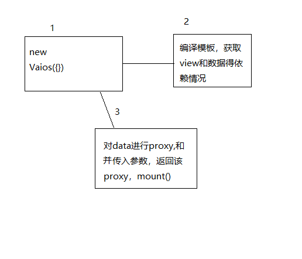
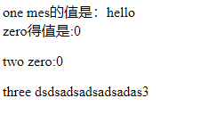
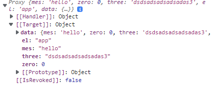

# Vaios

用了`React`和`Vue`,自己试着写个`mvvm`库。

## 插值表达式

这是一个 html 结构。明显，采用`{}`包裹起来得字符串是变量，第一步需要找到这个变量，再去替换 text，把变量转换成对应的`value`。

```html
<div id="app">
  <p>
    one
    <span> mes的值是：{mes}</span>
    <br />
    zero得值是:{zero}
  </p>

  <p>two zero:{zero}</p>
  <p>
    three
    <span>{three}</span>
  </p>
</div>
```

预计使用形式如下，嘿嘿，模仿`Vue`,在构造函数中传入一个对象，包含根节点，变量对象等。下面一步步去实现。

```js
const vaios = new Vaios({
  el: 'app',
  data: {
    mes: 'hello',
    zero: 0,
    three: 'dsdsadsadsadsadas3'
  }
}).mount()
```

流程图如下：


首先是构造函数得使用，需要使用`new`关键字生成一个可维护得对象存在，并且来提供组多方法。

```js
if (new.target === undefined) throw new Error('use new keyword')
// ...对输入参数进行判断
this.init(props)
```

### compile

首先通过*id*找到 dom 根节点。获取`data`数据，然后递归遍历 dom 结构。

```js
const rootDom = root(id) //获取节点
Object.assign(getVarArr.data, data) //收集初始data变量对象
lookAllDom(rootDom, component) //开始递归
return getVarArr //返回依赖

const getVarArr = {
  data: {},
  arr: []
} //收集依赖
```

具体递归函数，当前主要是文本得替换。

```js
forEach(Array.from(dom.childNodes), nodes => {
  switch (nodes.nodeType) {
    case 1: //处理dom相关操作，属性，表达式等
      isDom(nodes, getVarArr.data, component)
      lookAllDom(nodes, component)
      break
    case 3: //文本节点得替换
      isText(nodes, getVarArr, component)
      break
    case 8: //注释
      break
    default:
      lookAllDom(nodes, component)
  }
})
```

递归调用过程中，传递给替换文本参数有，node 节点，依赖收集对象（含初始 data），当前组件。

首先对文本节点得 text 进行校验``:

```js
export const isVar = /\{((?:.|\n)+?)\}/

if (!isVar.test(text.nodeValue)) return
```

如果当前 text 包含插值表达式，就将 text 变成使用*``*包裹得字符串，变量使用`${}`进行替换。
先获取一个字符串中所以满足得子字符串：`const regArr = _text.match(varG);`。

接着对`regArr`进行循环，按照每次循环得数组值进行字符串分割：

```js
let str = ''
let _text = text.nodeValue
for (let i = 0; i < regArr.length; i++) {
  const arr = _text.split(regArr[i])
}
```

然后进行拼接：

```js
str = `${str}${arr[0]}${
  '${data.' + regArr[i].replace('{', '').replace('}', '') + '}'
}`
_text = arr[1] //初始text变为后半段字符串
```

最后加入依赖对象 list 和更改 View:

```js
getVarArr.arr.push({
  _dom: text,
  _text: '`' + str + '`'
})
text.textContent = eval('`' + str + '`')
```

至此，转换插值已经完成。对模板的其他操作也在这里进行。

### observer

监听 data 对象。使用`Proxy`对初始 data 进行代理，改变添加`get`，`set`方法，在 set 得时候通知视图改变。

```js
const proxy = new Proxy(this.data, {
  get(target, key, receiver) {
    return target[key]
  },
  set(target, key, value, receiver) {
    target[key] = value
    observer.pud.nostiy()
    // do something
    return true
  }
})
```

```js
nostiy(key, value) {
  const data = this.data;//这里得data 指向 proxy
  this.arr.forEach((e) => {
    e._dom.textContent = eval(e._text);
  });
}
```

### mount()

最后调用`mount()`,把初始传入得属性加入到 proxy 上，放回这个 proxy。

```js
mount() {
  addProps(this.props, this.proxy);
  return this.proxy;
}
```

### 效果

页面：



对象：



## 元素属性

如下 html 代码：

```html
<button click="getZero()">{zero}++</button>
```

需要将上述`button`中得属性*click="getZero()"*转换成给 button 这个元素添加对应方法，在之前递归遍历中添加对 dom 操作得函数

```js
isDom(nodes, component, methods)
```

具体内容如下,遍历 dom 得属性组，和传入构造函数中得`methods`进行比对，再给 dom 添加事件即可。

```js
const isDom = (dom, component, methods) => {
  forEach(Object.values(dom.attributes), values => {
    if (values.name === 'click') {
      forEach(Object.entries(methods), method => {
        if (method[0] === values.value.replace('(', '').replace(')', '')) {
          dom.addEventListener('click', e => {
            method[1].call(component, e)
          })
        }
      })
    }
  })
}
```

注意，这里得`component`，是完成数据劫持后得 proxy 对象，因此我把之前得 compile 方法改成了 class 来进行处理。再劫持了`data`后进行 dom 方法得绑定。

```js
const compile = new Compile(this.el, this.data, methods)
compile.addComponent(this.proxy)
```

## 双向绑定

绑定与 input 上的双向绑定，即 input 的 value 绑定 data 里面的值，data 的值改变就去改变 value，监听 input 输入事件去修改 value。

```js

```
